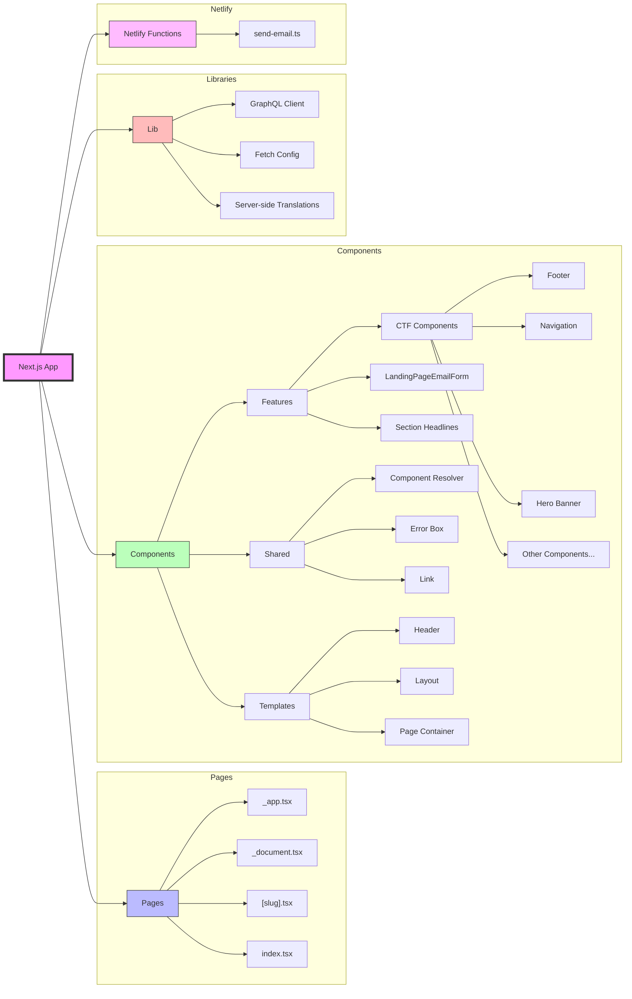

# Next.js Application Structure

## Directory Structure Overview

- **/pages**: Next.js routing and page components
  - Dynamic routes and app configuration
- **/components**: React components organized by feature
  - Features: Main functional components
  - Shared: Reusable utility components
  - Templates: Layout and structural components
- **/lib**: Core utilities and configurations
  - GraphQL setup
  - API configurations
  - Translation utilities
- **/netlify/functions**: Serverless functions
  - Email handling
  - API integrations

The application follows a feature-based architecture with Contentful integration (CTF components) and internationalization support. Components are organized by their role (features, shared, templates) for better maintainability and scalability.
